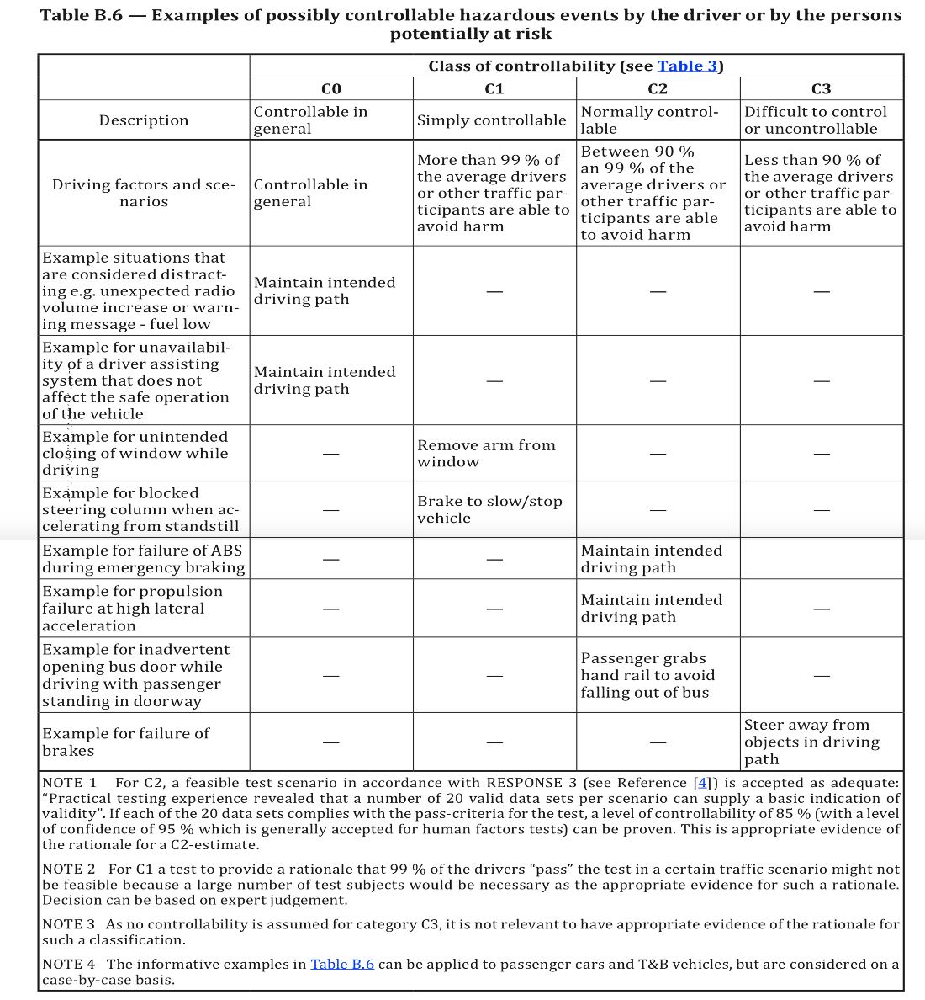
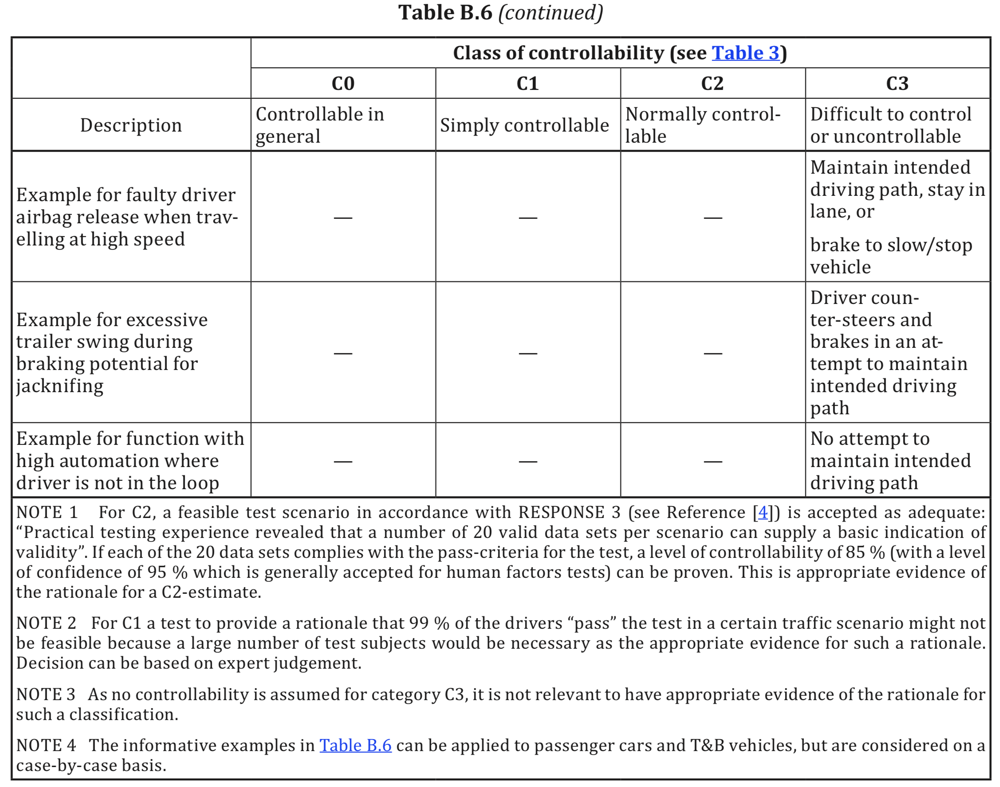

# Basic terms and definitions

## 3.1 Architecture

representation of the structure of the item \(3.84\) or element \(3.41\) that allows identification of building blocks, their boundaries and interfaces, and includes the allocation of requirements to these building blocks 

项目（3.84）或元素（3.41）的结构的表示形式，它用于识别结构模块，以及边界和接口，并包括对这些结构模块的需求分配

## 3.4 Assessment

examination of whether a characteristic of an item \(3.48\) or element \(3.41\) achieves the ISO 26262 objectives

## 3.5 Audit

Examination of an implemented process with regard to the process objectives

## 3. 7 Availability

capability of the item \(3.84\) or element \(3.41\) to meet assumed safety \(3.132\) requirements assigned with a given ASIL \(3.6\)

> Note 1 to entry: As a part of hardware safety requirements, achievement of the corresponding random hardware target values for fault metrics \(see ISO 26262-52018, Clauses 8 and 9\) allocated to the element \(3.41\) is included, if needed.

可用性

在在特定时间或给定的期间内,假设所需的外部资源是可用的,在给定条件下,产品处于执行所需功 \(2.69\)或 要 素 \(2.32\)的 版 本 。

## Confirmation measure

## Controllability

estimation of probability that someone is able to gain sufficient control of the hazardous event, such that they are able to avoid the specific harm.

The parameter C is used to classify the potential of avoiding the harm by traffic participants.

Examples of controllability can be found in ISO 26262-3:2018\(E\) B.6.

## 3.41 Element

system \(3.163\) that consists of electrical or electronic elements \(3.41\),  including programmable electronic elements \(3.41\)

> Note 1 to entry:  when "software element" or "hardware element" is used, this phrase denotes an element of software or an element of hardware only, respectively.
>
> Note 2 to entry: an element may also be a SEooC \(3.138\)

由电气或电子元件（3.41）组成的包括可编程电子元件（3.41）的 系统（3.163）

## 3.46 Error

discrepancy between a computed, observed or measured value or condition, and the true, specified or theoretically correct value or condition

计算的、观测的、测量的值或条件与真实的、规定的、理论上正确的值或条件之间的差异。

> Note 1 to entry: an error can arise as a result of a fault \(3.54\) within the system \(3.163\) or component \(3.21\) being considered

## 3.48 Exposure

state of being in an operational situation \(3.104\) that can be hazardous if coincident with the failure mode \(3.51\) under analysis

> Note 1 to entry: the parameter "E" in hazard analysis and risk assessment \(3.76\) represents the potential exposure to the operational situation \(3.104\)

## External measure

measure that is separate and distinct from the item \(3.84\) which reduces or mitigates the risks \(3.128\) resulting from the item \(3.84\)

## T&B

Trucks, Buses, trailers and semi-trailers

## References

1. [ISO 26262-3:2018 Road vehicles — Functional safety ](https://www.iso.org/standard/68383.html)

