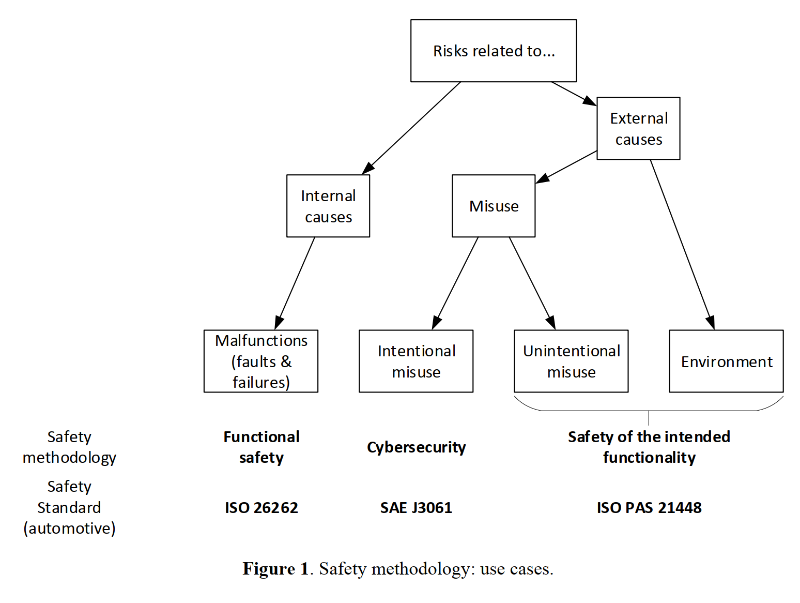

# FuSa and SOTIF

## Definitions:

**Functional safety** \(FuSa\)is defined as:

absence of unreasonable risk \(3.176\) due to hazards \(3.75\) caused by malfunctioning behavior \(3.88\) of E/E systems.

 **Safety of the Intended Functionality** \(SOTIF\) ****is defined as:

The absence of unreasonable risk due to hazards resulting from functional insufficiencies of the intended functionality or by reasonably foreseeable misuse by people.

## Comparisons

### Scope

FuSa is to prevent any crashes caused by E/E systems. FuSa focuses on the prevention of failures or malfunctions and taking the system to a safety state if there is any failures in the system.

 **Functional Safety = Prevent + Detect + Control + Mitigate Failures**

The part of safety that is not related to failures but to limitations of the nominal performance is covered by SOTIF.

Reference: **Driver assistance systems: analysis, tests and the safety case. ISO 26262 and ISO PAS 21448** by O M Kirovskii and V A Gorelov 2019 IOP Conf. Ser.: Mater. Sci. Eng. 534 01 2019

SOTIF is a safety process that addresses unintended system behavior in the absence of random hardware failures.

FuSa and SOTIF are often combined to achieve traceability of requirements and facilitate the development of Safety Case.

## References

[A guide to compliance in software development -- What is functional safety](https://www.perforce.com/resources/qac/what-is-functional-safety)

