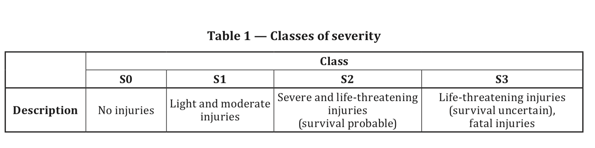
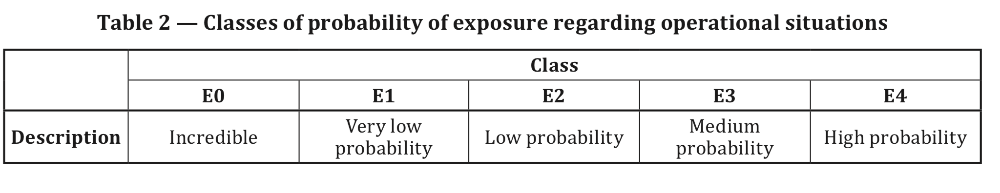
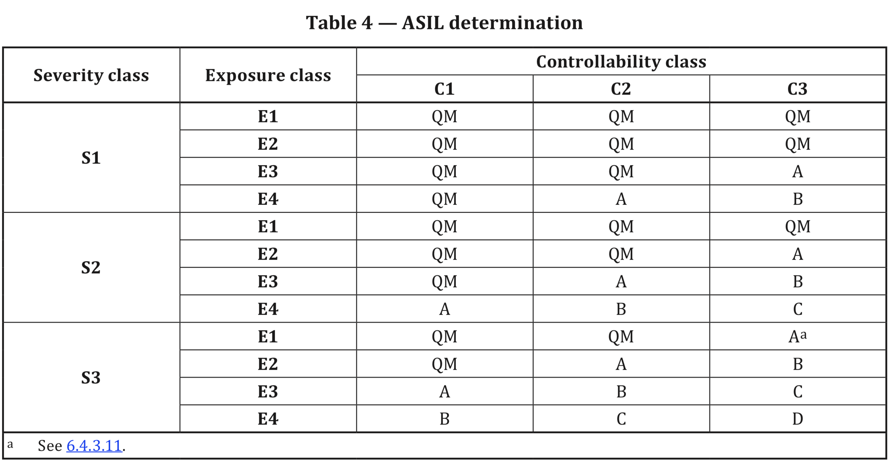

# Hazard analysis and risk assessment \(HARA\)

危害分析和风险评估

## Definition

**3.76 Hazard analysis and risk assessment \(HARA\)**

method to identify and categorize hazardous events \(3.77\) of items \(3.84\) and to specify safety goals \(3.139\) and ASILs \(3.6\) related to the prevention or mitigation of the associated hazards \(3.75\) in order to avoid unreasonable risk \(3.176\)

## Objectives

* to identify and to classify the hazardous events caused by malfunctioning behavior of the item; and
* to formulate the safety goals with their corresponding ASILs related to the prevention or mitigation of the hazardous events, in order to avoid unreasonable risk.

## Procedures

### Step 1 : Prerequisites and further supporting information

 Item definitions, relevant information on other items shall be available.

### Step 2: HARA initialization

HARA should be based on a defined item.

### Step 3: Situation analysis and hazard identification

**Situation analysis**

The operational situation and operating modes in which an item's malfunctioning behavior will lead to a hazardous event shall be described, both when the vehicle is correctly used and when it is incorrectly used.

**Hazard identification**

Hazards shall be determined based on possible malfunctioning behavior of the item. **FMEA** and **HAZOP** plus brainstorming, checklist, quality history, and field studies can be used in hazard identification at the item level.

Hazards resulted from item malfunctioning behavior shall be defined at the vehicle level

Probable causes of hazards doesn't need to be considered in HARA. Only hazards that are associated with malfunctioning behavior are considered.

Consequences of hazardous events shall be identified.

### Step 4: Classification of hazardous events

All hazardous events identified in Step 3 needs to be classified with respect to severity \(S\), probability of exposure \(E\), and controllability \(C\). The classification should be conducted conservatively, meaning whenever there is a doubt, a higher S, E, and C should be used. See Table 1, 2, and 3 for more details about S, E, and C.

**Severity** 

The risk assessment of hazardous events should consider the driver and passengers of the vehicle causing the hazardous events, and also other people potentially at risk including occupants of other vehicles, pedestrians, and bicyclists.

If a hazardous event is classified as  severity class S0, then no ASIL assignment is needed.

**Exposure**

The difference in probability from one E class to the next \(for class E1 to E4\) is an order of magnitude.

If a hazardous event is classified as exposure class E0, then no ASIL assignment  is needed.

**Controllability**

The controllability of each hazardous event, by the driver or other persons involved in the situation shall be estimated.

The difference in probability from one C class to the next \(for class C1 to C3\) is an order of magnitude.

If a hazardous event is classified as controllability C0, then no ASIL assignment is needed.

**ASIL**

An ASIL shalled be determined based on the estimated S, E, and C according to Table 4.

There are ASIL A, B, C, D, and QM classes. The class QM \(quality management\) denotes no requirement to comply with ISO 26262. Class QM in Table 4 indicates that the quality processes are sufficient to manage the identified risk. The safety goal needs to be determined for each ASIL class based on HARA.

### Step 5: Safety goals determination

Safety goals are top-level safety requirements for the item.  

> **Safety goals can specify the fault tolerant time interval or physical characteristics, for example, a maximum level of unwanted steering-wheel torque, maximum level of unwanted acceleration.**

### Step 6: Management of variances of T & B in HARA

Each type of base vehicle shall be considered when conducting HARA.

### Step 7: Verification

The HARA with safety goals shall be verified in accordance with ISO 26262 : 2018\(E\) Part-8, Clause 9 to provide evidence for:

* Selection of operational situations and hazard identification
* Compliance with the item definition
* Completeness of the coverage of the hazardous events
* Consistency with related HARA of other items
* Consistency of the safety goals with assigned ASIL

### Step 8: Work products

* HARA report
* Verification report of the HARA resulting from Step 7: Verification

## References

1. [ISO 26262-3:2018 Road vehicles — Functional safety ](https://www.iso.org/standard/68383.html)

   [How HARA Helps Functional Safety \(ISO 26262\) Consultants to Determine ASIL Values and Formulate Safety ](https://www.embitel.com/blog/embedded-blog/hara-by-iso-26262-standard-for-your-functional-safety-project)

2. [How HARA Helps Functional Safety \(ISO 26262\) Consultants to Determine ASIL Values and Formulate Safety Goals](https://www.embitel.com/blog/embedded-blog/hara-by-iso-26262-standard-for-your-functional-safety-project)



