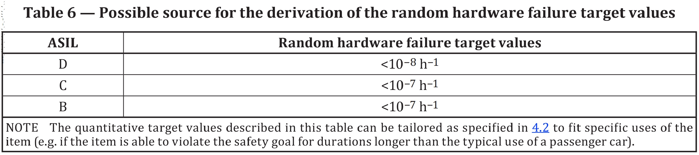

# FTA

According to ISO 26262,  top-level events of fault trees represent hazardous events, which typically is a violation of a safety goal.

FTA is used to evaluate safety goal violations due to random hardware failures. Beside FTA, cut-set analysis can also be used to do the same work as FTA does. FTA and FMEA are used to support hardware design while FMEDA is used to verify  hardware design. The results of FTA is usually evaluated according to Figure 6 - Part 5.

FTA needs to consider the following:

* the architecture of the item, namely design architecture;
* the estimated failure rate for the failure modes of each hardware part that would cause a single-point fault or a residual fault;
* the estimated failure rate for the failure modes of each hardware part that would cause a dual-point fault;
* the diagnostic coverage of safety-related hardware elements by safety mechanisms; and
* the exposure duration in the case of dual-point faults;

## 

## References

1. [ISO 26262-3:2018 Road vehicles — Functional safety ](https://www.iso.org/standard/68383.html)

