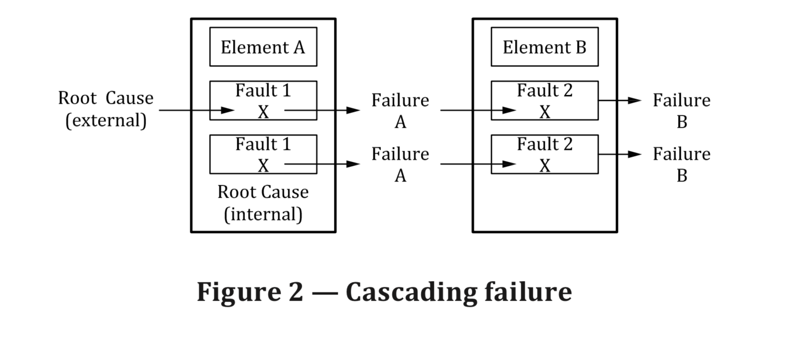
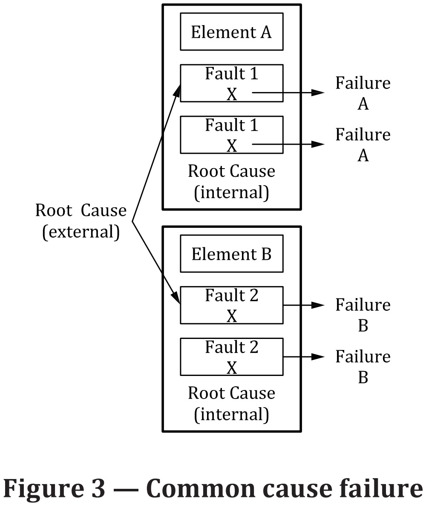

# Failure-related terms and definitions

## 3.50 Failure

termination of an intended behavior of an element \(3.41\) or an item \(3.84\) due to a fault \(3.54\)

由于故障所导致的要素的或者元件的预期行为的终止

## 3.51 Failure mode

manner in which an element or an item fails to provide the intended behavior

## 3.52 Failure mode coverage \(FMC\)

proportion of the failure rate \(3.53\) of a failure mode \(3.51\) of a hardware element \(3.41\) that is detected or controlled by the implemented safety mechanism \(3.142\)

## 3.53 Failure rate

probability density of failure \(3.50\) divided by probability of survival for a hardware element \(3.41\)

Note 1 to entry: the failure rate is assumed to be constant is generally denoted as λ.

## Base failure rate \(BFR\)

failure rate \(3.53\) of a hardware element \(3.41\) in a given application use case used as an input to safety \(3.132\) analyses 

给定应用程序用例中的硬件元素（3.41）的故障率（3.53\), 用作安全性（3.132）分析的输入

## Single-point failure \(单点失效\)

failure \(3.50\) that results from a single-point fault \(3.156\)

## Dual-point failure \(双点失效\)

failure \(3.50\) resulting from the combination of two independent hardware faults \(3.54\) that leads directly to the violation of a safety goal \(3.139\) \(由两个独立硬件故障引起且直接导致违背安全目标的失效\)

Note 1 to entry: dual-point failures are multiple-point failures \(3.96\) of order 2.

Note 2 to entry: dual-point failures that are addressed in the ISO 26262 series of standards include those where one fault \(3.54\) affects a safety-related element \(3.144\) and another fault \(3.54\) affects the corresponding safety mechanism \(3.142\) intended to achieve or maintain a safe state \(3.131\). （ISO 26262 提到的双点失效包括这些失效，即有一个故障影响安全相关要素，另一个故障影响到相关的达到或者保持安全状态的安全机制而导致的失效）

## Multiple-point failure

failure \(3.50\) resulting from the combination of several independent hardware faults \(3.54\), which leads directly to the violation of a safety goal \(3.139\).

## 3.29 Dependent failures \(相关失效\)

failures \(3.50\) that are not statistically independent, i.e. the probability of the combined occurrence of the failures \(3.50\) is not equal to the product of the probabilities of the occurrence of all considered independent failures \(3.50\).

when failure A and failure B satisfies the following relation:

$$
P_{AB} \ne P_A \times P_B
$$

then failure A and failure B can be regarded as dependent failures,  where :

$$
P_{AB}
$$

is the probability of failure A and failure B both occur

$$
P_A
$$

is the probability of of failure A occurs

$$
P_B
$$

is the probability of failure B occurs.

Note 1 to entry: dependent failures can manifest themselves simultaneously, or within a sufficiently short time interval, to have the effect of simultaneous failures \(3.50\).

Note 2 to entry: dependent failures include common cause failures \(3.18\) and cascading failures \(3.17\).

Note 3 to entry:  whether a given failure \(3.50\) is a cascading failure \(3.17\) or a common cause failure \(3.18\) may depend on the hierarchical structure of the elements \(3.41\).

Note 4 to entry: whether a given failure \(3.50\) is a cascading failure \(3.17\) or a common cause failure \(3.18\) may depend on the temporal behavior of the elements \(3.41\).

Note 5 to entry: dependent failures can include software failures \(3.50\) even if the probability of the failure \(3.50\) is not calculated.

## 3.29 Dependent failure initiator \(DFI\)

single root cause that leads multiple elements \(3.41\) to fail through coupling factors \(3.26\)

Note 1 to entry: coupling factors \(3.26\) which are candidates for dependencies are identified during dependent failure analysis \(DFA\).

Note 2 to entry: failure \(3.50\) of elements \(3.41\) can happen simultaneously or sequentially.

Example 1:  coupling factor \(3.26\): two SW units using the same RAM. Root cause: one SW unit unintentionally corrupts data used by the second SW unit.

Example 2:  coupling factor \(3.26\): two ECUs operating in the same compartment of the car. Root cause: unwanted/unexpected water intrusion into that particular compartment leads to flooding and to failure \(3.50\) of both ECUs.

Example 3:  coupling factor \(3.26\): two microcontrollers using the same 3,3 V power supply. Root cause: overvoltage on the 3, 3 V, damaging both microcontrollers.

## 3.17 Cascading failure \(级联失效\)

failure \(3.50\) of an element \(3.41\) of an item \(3.84\) resulting from a root cause \[ inside or outside of the element \(3.41\) \] and then causing a failure \(3.50\) of another element \(3.41\) or elements \(3.41\) of the same or different item \(3.84\)

由根本原因 \[ 要素（3.41）的内部或外部 \] 导致项目（3.84）的要素（3.41）的失效（3.50）然后导致相同或不同项目（3.84）的一个要素（3.41）或多个要素（3.41）的失效（3.50）

> Note 1 to entry: cascading failures are dependent failures \(3.29\) that could be one of the possible root causes of a common failure \(3.18\). See Figure 2.

> 注: 级联失效是一个共因失效的某个根本原因引起的相关失效 \(3.29\) 见图2

Figure 2 indicates that：

* an external root cause caused a Fault 1 in Element A which led to a Failure A. Then this Failure A caused Fault 2 in Element B which led to a Failure B;
* an internal root cause caused a Fault 1 in Element A which led to a Failure A. Then this Failure A caused a Fault 2 in Element B which led to a Failure B

## 3.18 Common Cause Failure \(CCF\)

failure \(3.50\) of two or more elements \(3.41\) of an item \(3.84\) resulting directly from a single specific event or root cause which is either internal or external to all of these elements \(3.41\)

Note 1 to entry: common cause failures are dependent failures \(3.29\) that are not cascading failures \(3.17\). see Figure 3

## 3.79 Independent Failures

failures \(3.50\) whose probability of simultaneous or successive occurrence can be expressed as the simple product of their unconditional probabilities.

> Note 1 to entry: independent failures can include software failures \(3.50\) even if their probability of failure is not calculated.

## References

1. [ISO 26262-3:2018 Road vehicles — Functional safety ](https://www.iso.org/standard/68383.html)

