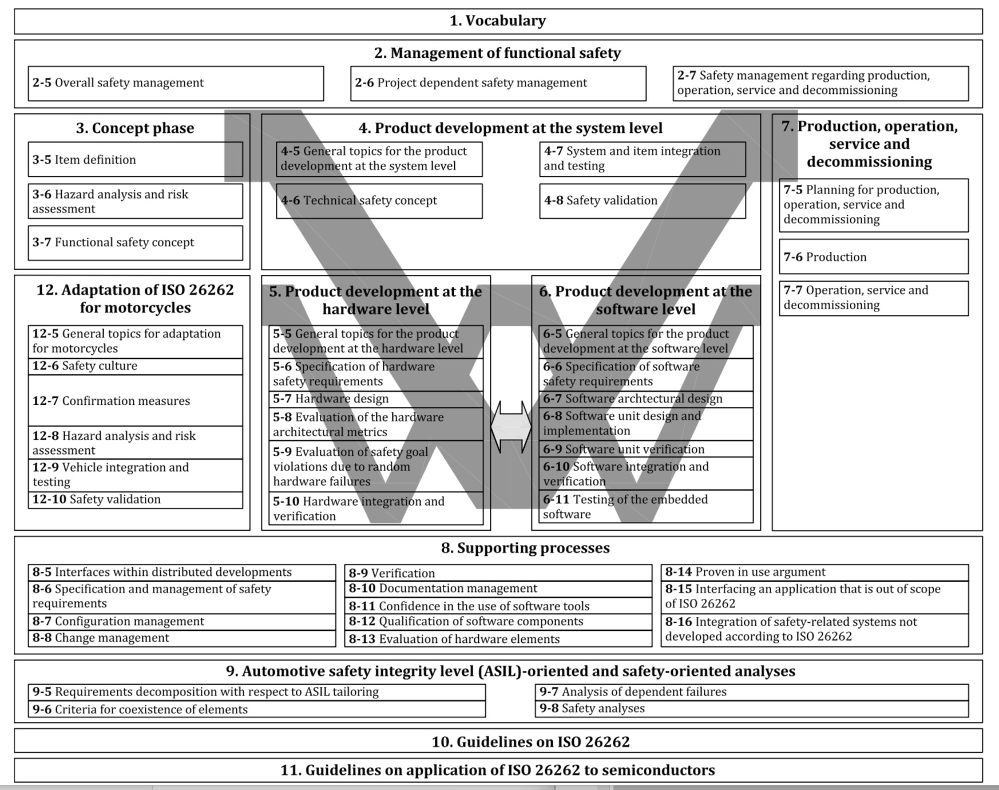

# V model and safety life cycle

## V model

The V model in ISO 26262 is often used to illustrate the life cycle of functional safety.

All 12 parts are included in the V model. The **safety life cycle** consists of five phases:

* 3. Concept phase \(Part 3 of ISO 26262\)
* 4. Product development at the system level \(Part 4\)
* 5. Product development at the hardware level \(Part 5\)
* 6. Product development at the software level \(Part 6\)
* 7. Production, operation, service and decommissioning \(Part 7\)

## V model at the software level

part 6 page 4

## FuSa safety life cycle

## SOTIF safety life cycle

SOTIF is limited to the concept phase and system-level activities. The safety assurance of the intended functionality on software level is part of what may be called “Safety of Artificial Intelligence”. 

